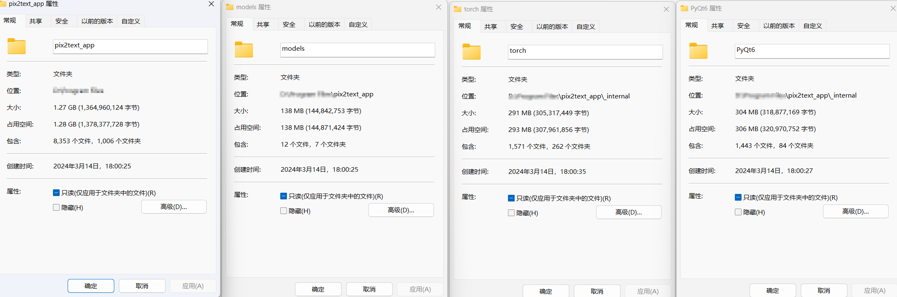

# 离线LaTex公式识别V1.0开发

## 已完成的内容

- [x] LaTex公式识别的GUI。
- [x] 支持将LaTex复制为MathML。
- [x] 支持读取剪切板的图片。

部分UI换成iconfont下载的一些元素。

读懂pyqt的一些代码。基本实现了万能君的软件库的所有功能。

开发过程暂时告一段落。

## 删除内容

公式识别软件，不是刚需，之前的版本占用了8G的内存，其中torch占用3个G(GPU版本），模型2个多G、属实是本末倒置。因此本版本删除了Nougat、Texify,以节约工具占用的存储空间。

尽管Pix2Text在印刷体的识别精度某些程度上是不如Nougat、Texify的，但是它支持手写体公式的识别，此外模型也是比较小的，不到200MB。

经过瘦身后的工具占用空间1.2G。

尽量的在瘦身。

## 使用案例

### 印刷体

### 手写公式

