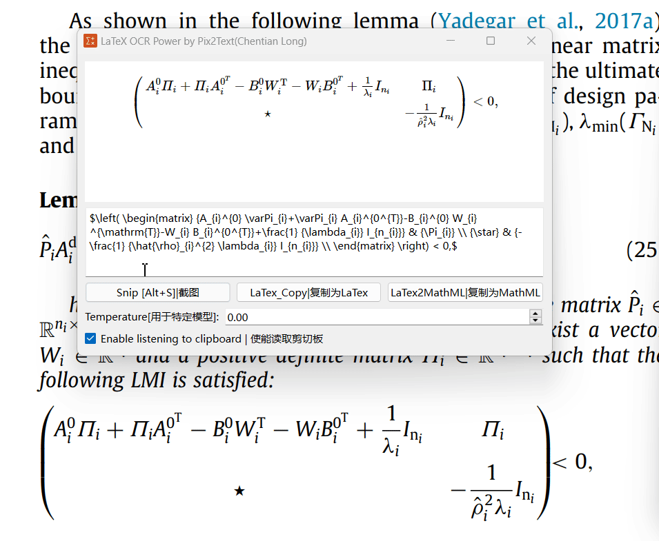
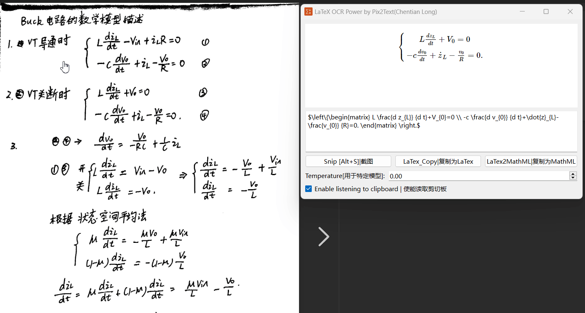

# Pix2Text-nougat-texify-GUI-offline

## 工程来源

感谢这些github上的工程：

[LaTeX-OCR: pix2tex](https://github.com/lukas-blecher/LaTeX-OCR)提供GUI；

[Pix2Text](https://github.com/breezedeus/Pix2Text/tree/main)提供模型Model；

## 已完成的内容

- [x] LaTex公式识别的GUI。
- [x] 支持将LaTex复制为MathML。
- [x] 支持读取剪切板的图片。

部分UI换成iconfont下载的一些元素。

读懂pyqt的一些代码。基本实现了万能君的软件库的所有功能。

开发过程暂时告一段落。

## GUI

### 印刷体

### 手写公式

