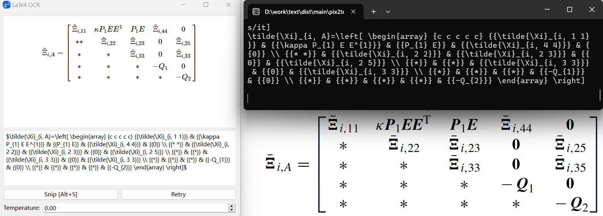
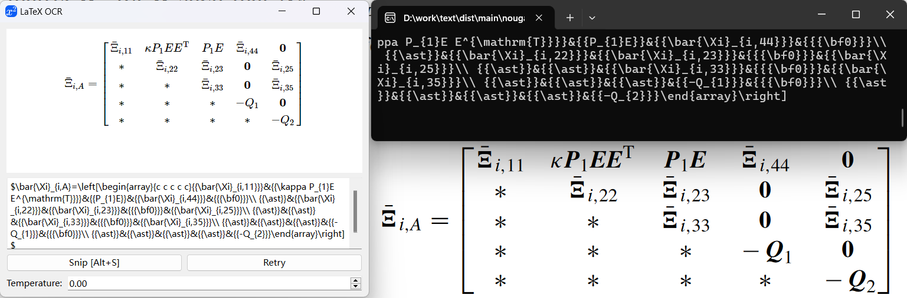
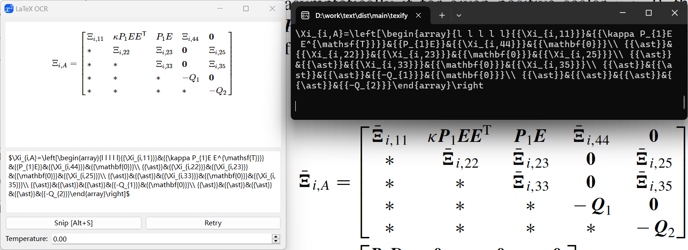
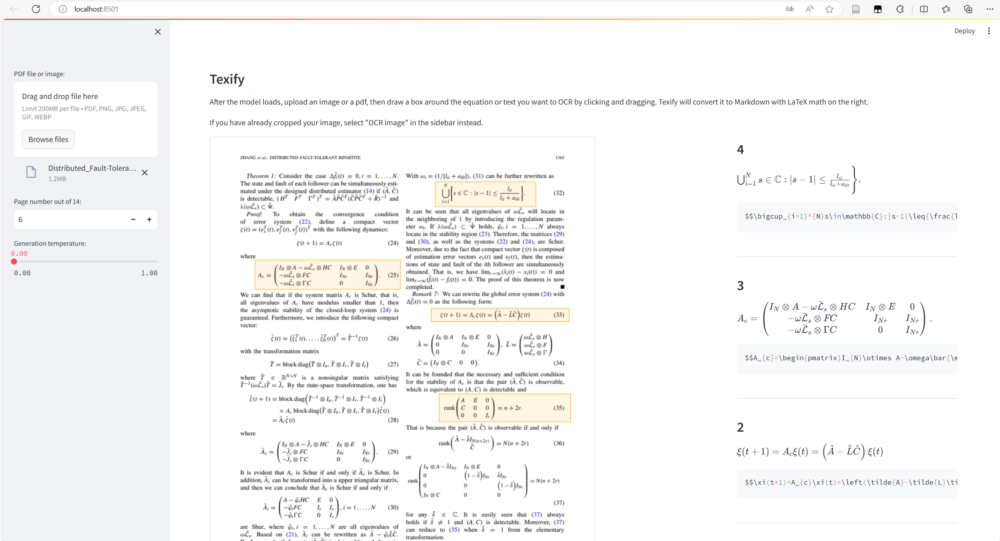

# Pix2Text-nougat-texify-GUI-offline

## 工程来源

感谢这些github上的工程：

[LaTeX-OCR: pix2tex](https://github.com/lukas-blecher/LaTeX-OCR)提供GUI；

[Pix2Text](https://github.com/breezedeus/Pix2Text/tree/main)提供模型Model；

[nougat-latex-ocr](https://github.com/NormXU/nougat-latex-ocr)提供模型Model；

[texify](https://github.com/VikParuchuri/texify) 提供模型、提供streamlit_app代码。

## GUI

### Pix2Text

### Nougat_Latex

### Texify

### streamlit power by Texify

## 后记

才疏学浅，代码写的很Low,不会Qt,只会简单调用模型。

期待有缘人能结合这个GUI改一下[mygoosh/Mathematical_formula: 基于Pix2Text+PyQT5完成的可视化数学公式识别提取工具，可直接提取为LaxTex、MathML格式，也可仅识别文本内容（准确率低）（Python期末设计/大作业） (github.com)](https://github.com/mygoosh/Mathematical_formula/tree/main)

